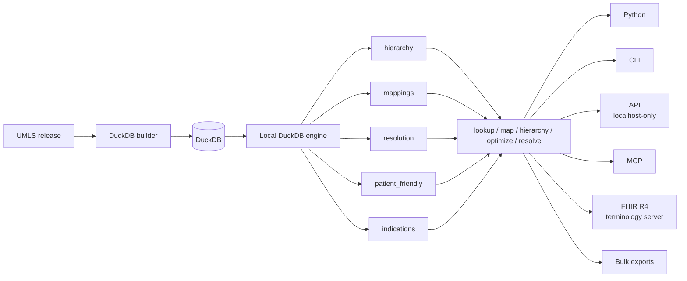

medterm4ds keeps terminology logic in shared services and keeps interfaces thin.

The local DuckDB engine is split into focused modules (extracted during the Tier C refactor):

- **`engine.py`** — dispatcher + remaining helpers (~2,100 lines)
- **`hierarchy.py`** — parent/child/ancestor/descendant traversal
- **`mappings.py`** — source-to-target code mappings (same-CUI + ancestor walk)
- **`resolution.py`** — active/historical/obsolete/NDC code resolution
- **`patient_friendly.py`** — per-source patient-friendly name resolvers
- **`indications.py`** — condition-to-medication may_treat/may_prevent traversal

Core rules:

- Services own behavior.
- Engines own data access. Domain layer composes services — it does not run SQL directly.
- CLI, API, and MCP adapt inputs and outputs. API binds to `127.0.0.1` by default (local-only multi-process sidecar; see `SECURITY.md`).
- Bulk workflows stream over the same services.
- Models carry provenance such as `match_type`, `match_depth`, and `matched_via`.

Quality is verified by a tiered regression suite (`tests/regression/`) that runs
against the real UMLS DuckDB and compares every field of every record in the
fhir4px deliverables against a golden baseline.

This keeps local mode, API mode, bulk mode, and MCP mode from becoming separate implementations.
