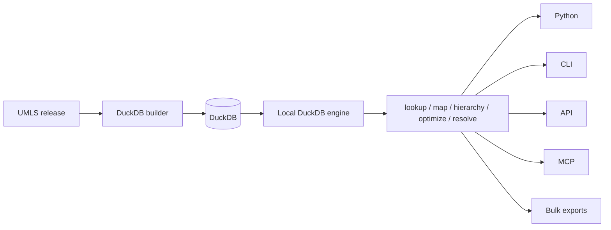

medterm4ds keeps terminology logic in shared services and keeps interfaces thin.

Core rules:

- Services own behavior.
- Engines own data access.
- CLI, API, and MCP adapt inputs and outputs.
- Bulk workflows stream over the same services.
- Models carry provenance such as `match_type`, `match_depth`, and `matched_via`.

This keeps local mode, API mode, bulk mode, and MCP mode from becoming separate implementations.
